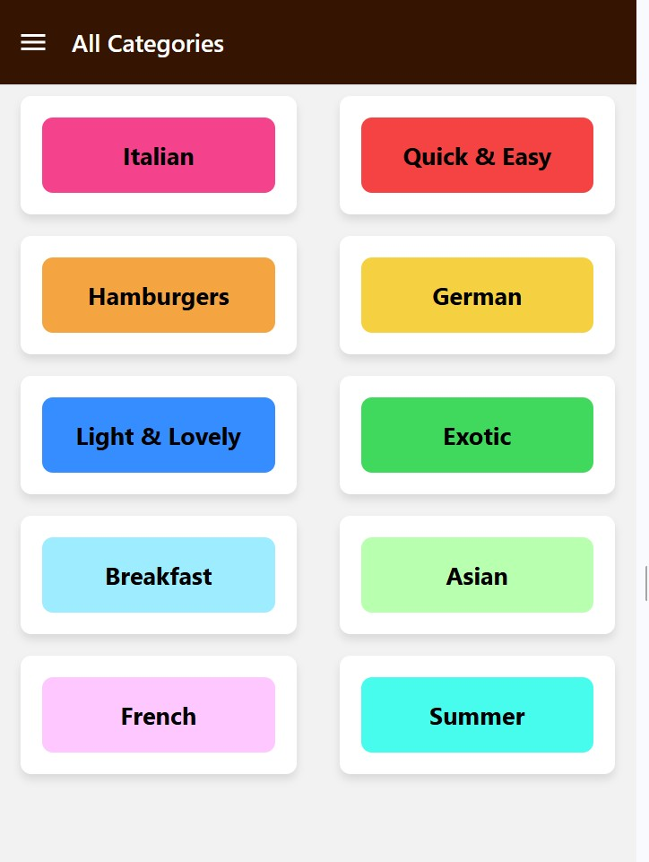
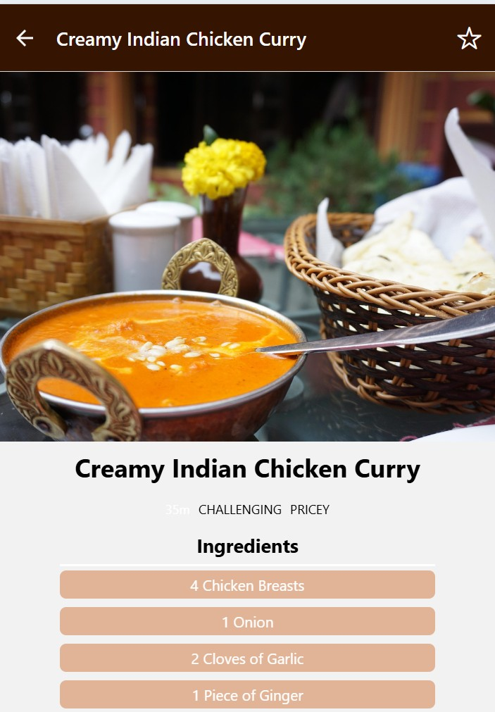
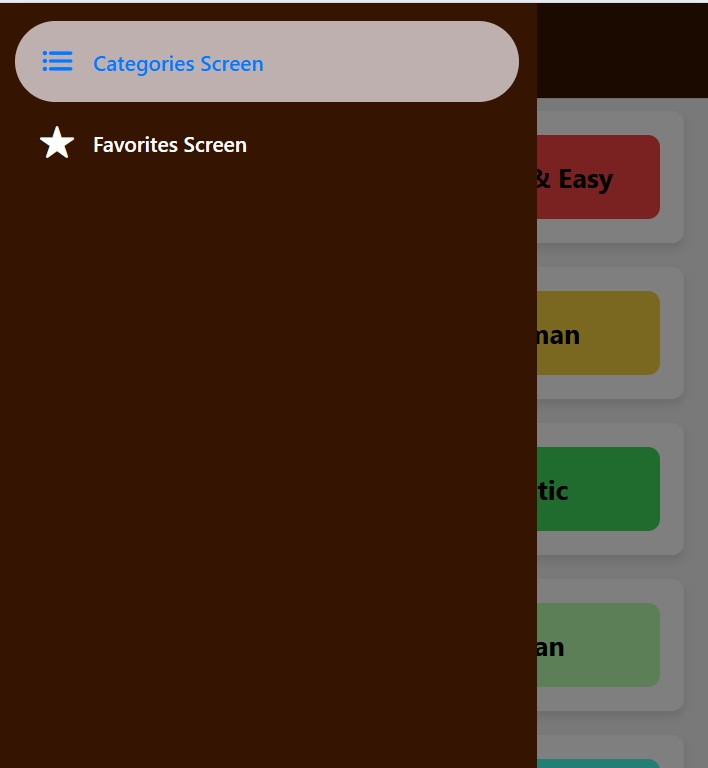
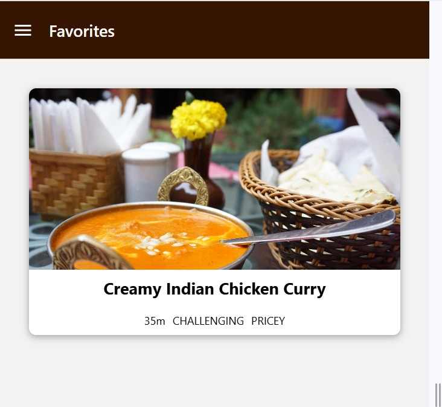

## Simple Meals App App 
A simple React Native app to demonstrate use of Navigation for a Meals App 

## Features 
<ul>
    <li>Demonstrates use of navigation <a href="https://reactnavigation.org/docs/getting-started">React navigation</a></li>
    <li>Installed Navigation package with  
    npm install @react-navigation/native 
    npx expo install react-native-screens react-native-safe-area-context 
</li>
    <li>Demonstrates use of Stack navigators listed under <a href="https://reactnavigation.org/docs/stack-navigator">Navigators</a> using 
    npm install @react-navigation/stack</li>
    <li>Demonstrates use of Drawer navigators listed under <a href="https://reactnavigation.org/docs/drawer-navigator">Navigators</a> using 
    npm install @react-navigation/drawer 
    npx expo install react-native-gesture-handler react-native-reanimated</li>
    <li>Demonstartes use of button on the Header on a screen</li>
    <li>Demonstrates usage of useEffectLayout for updates to options of the screen for example title , button etc. </li>
    <li>Demonstrates use of Bottom Tabs Navigation used for both Android and IOS versus Materials Tabs and install  
    npm install @react-navigation/bottom-tabs </li>
    <li>Demonstrates use of nested Navigation with combination of Navigators  
            Navigation Flow
        Drawer
        └── Tabs
            ├── Categories (Stack)
            └── Favorites (Stack)
                └── MealDetail (Stack)
     </li>
    <li>Demonstrates manage app wide state for managing Favorites using Context API</li>
    <li>Demonstrates using Redux for state management with <a href="https://redux-toolkit.js.org/">Redux</a>  
    npm install @reduxjs/toolkit  
    </li>
</ul>

## ScreenShots 
Meal Categories Screen Landing   

  
 

Meals Ovewview Screen  

  
 

Meals Detail Screen  

  
 

Navigation Screen  

  
 

Favorites Screen  

  
 

## Tech Stack 
React Native 

## Installation 
git clone this repo 
cd authenticator-appr 
npm install 
npm start 
Note: You’ll need Node.js, Expo CLI, and a mobile simulator or Expo Go app. 

## Project Structure  

/components      # Reusable UI components  
 
/App.js          # Entry point   

/screens         # Screen layouts for Meals Overview  

/data            # Static data points  

/store           # For State Management  

/models          # Models for Meal and Category  

